# データベースのテーブル情報

　本項では、本アプリケーションが使用するデータベースのテーブルについて説明します。

> [全体の目次に戻る](../README.html)

## 目次

- [目次](#目次)
- [概要](#概要)
- [ユーザー情報 (users)](#ユーザー情報-users)
- [グループ (groups)](#グループ-groups)
- [役職 (positions)](#役職-positions)
- [プロジェクト (projects)](#プロジェクト-projects)
- [取引先 (company)](#取引先-company)
- [確定済み未出力仕訳 (fix\_journals)](#確定済み未出力仕訳-fix_journals)
- [フォーム (forms)](#フォーム-forms)
- [申請書 (requests)](#申請書-requests)
  - [メイン (requests)](#メイン-requests)
  - [customized\_items](#customized_items)
  - [expense](#expense)
  - [payment](#payment)
  - [ec](#ec)
  - [approval\_process](#approval_process)
  - [viewers](#viewers)
  - [変更履歴 (modify\_logs)](#変更履歴-modify_logs)
  - [ファイル (files)](#ファイル-files)
  - [申請書 (requests) まとめ](#申請書-requests-まとめ)

## 概要

　ジョブカンAPIで取得できるデータのうち、本アプリケーションで取得しているデータとテーブルとの対応関係を以下に示します。テーブル名のうち、左に🔵が付与されているものは最上位のテーブルとなります。

**表** ジョブカンAPIとテーブルの対応関係

| ジョブカンAPI | テーブル |
| --- | --- |
| ユーザー情報 | 🔵`users` `user_groups` `user_positions` `user_bank_accounts` |
| グループ | 🔵`groups` |
| 役職 | 🔵`positions` |
| 申請書 | 🔵`requests` `customized_items` `generic_masters` `generic_master_additional_items` `table_data` `expense` `expense_specifics` `expense_specific_rows` `custom_items` `custom_item_values` `custom_item_value_extension_items` `payment` `payment_specifics` `payment_specific_rows` `ec` `shipping_address` `ec_specifics` `ec_specific_rows` `approval_process` `approval_route_modify_logs` `approval_steps` `approvers` `comments` `comment_associations` `viewers` `modify_logs` `modify_log_details` `modify_log_detail_specifics` `files` `file_associations` |

## ユーザー情報 (users)

　ジョブカンに登録されているユーザー情報を格納するテーブルです。ユーザー情報には、ユーザーの基本情報と、ユーザーが所属するグループや役職、銀行口座情報が含まれます。

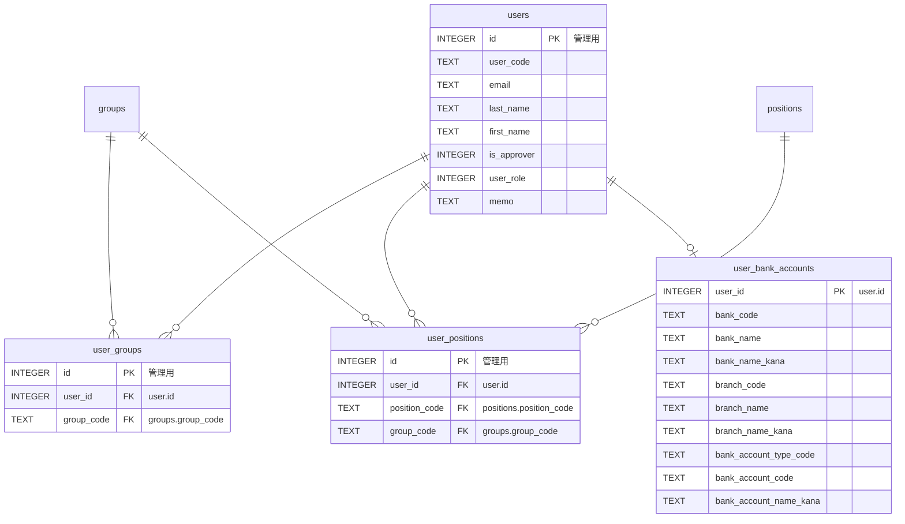

**図** ユーザー情報テーブルのER図．`管理用`と書かれている部分は元データには存在しないキーです．また、複合UNIQUE制約については省略しています．

## グループ (groups)

　ジョブカンに登録されているグループ情報を格納するテーブルです。グループ情報には、グループの基本情報と、グループに所属するユーザー情報が含まれます。

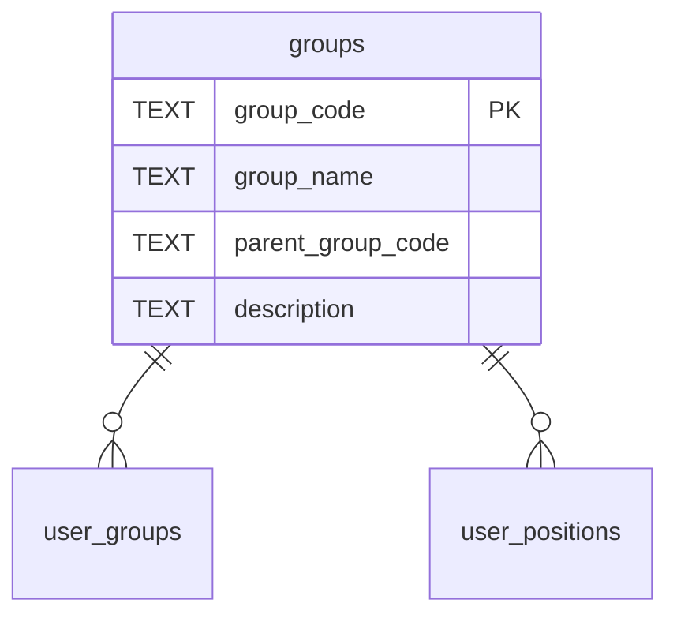

**図** グループテーブルのER図．`user_groups`と`user_positions`は[ユーザー情報](#ユーザー情報-users)のテーブルとの関連を示しています

## 役職 (positions)

　ジョブカンに登録されている役職情報を格納するテーブルです。役職情報には、役職の基本情報が含まれます。

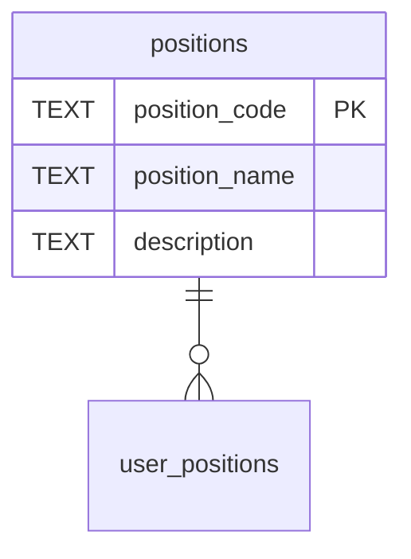

**図** 役職テーブルのER図．`user_positions`は[ユーザー情報](#ユーザー情報-users)のテーブルとの関連を示しています

## プロジェクト (projects)

　ジョブカンに登録されているプロジェクト情報を格納するテーブルです。プロジェクト情報には、プロジェクトの基本情報が含まれます。

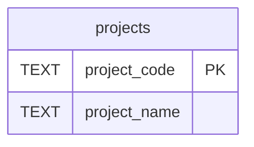

**図** プロジェクトテーブルのER図．

## 取引先 (company)

　ジョブカンに登録されている取引先情報を格納するテーブルです。取引先情報には、取引先の基本情報が含まれます。

　ここで、`bank_account_type_code`は`"1"`などの数字で表されていますが、確認できる範囲では以下のように対応しているようです。

- `"1"`: 普通
- `"2"`: 当座
- `"9"`: その他

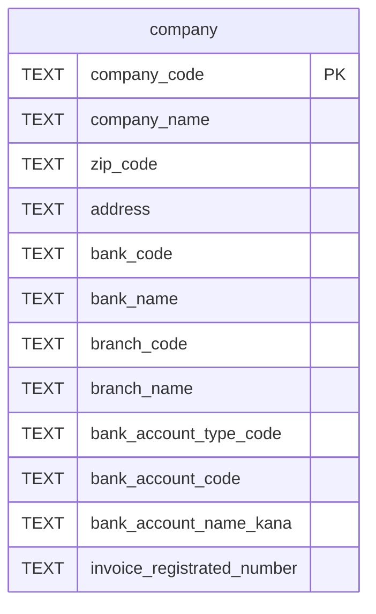

**図** 取引先テーブルのER図．

## 確定済み未出力仕訳 (fix_journals)

　ジョブカンに登録されている確定済み未出力仕訳情報を格納するテーブルです。APIによるデータ取得時点で未出力の仕訳情報が格納されますが、本ソフトウェアが当テーブルからデータを削除することはありません。このため、古いデータについては出力済みの可能性があります。

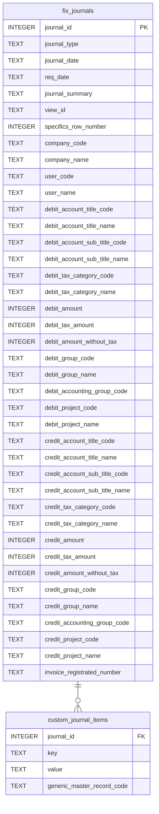

**図** 確定済み未出力仕訳テーブルのER図．

## フォーム (forms)

　ジョブカンに登録されているフォーム情報を格納するテーブルです。フォーム情報には、フォームの基本情報が含まれます。

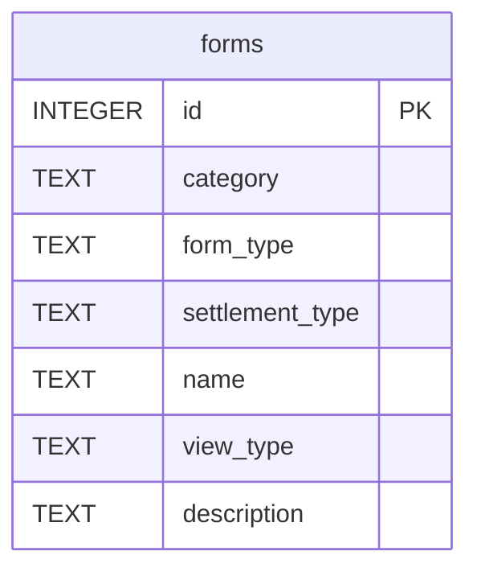

**図** フォームテーブルのER図．

## 申請書 (requests)

　ジョブカンに登録されている申請書情報を格納するテーブルです。申請書情報には、申請書の基本情報と、申請書に関連する情報が含まれます。

### メイン (requests)

　申請書の基本情報を格納するテーブルです。申請書の基本情報には、申請書のタイトルやステータス、申請書の種類や申請書の提出日時、申請者の情報などが含まれます。

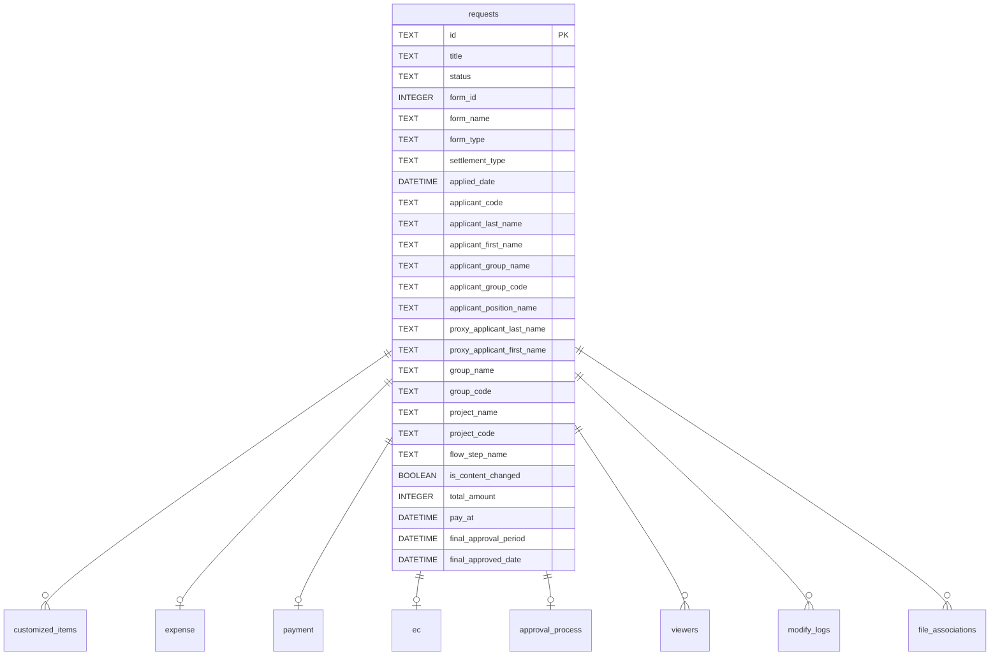

**図** 申請書テーブルのER図(一部)．`requests`テーブルと直接の関連があるテーブルのみを示しています

### customized_items

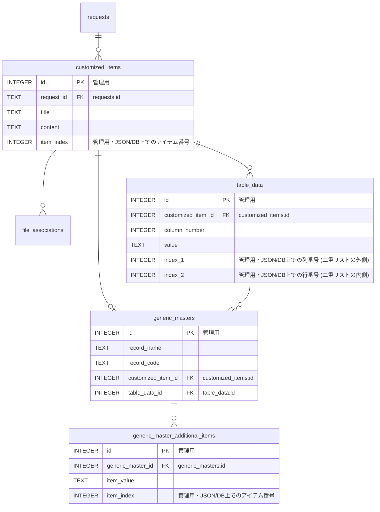

**図** customized_itemsテーブルまわりのER図．`管理用`と書かれている部分は元データには存在しないキーです．また、複合UNIQUE制約については省略しています．

### expense

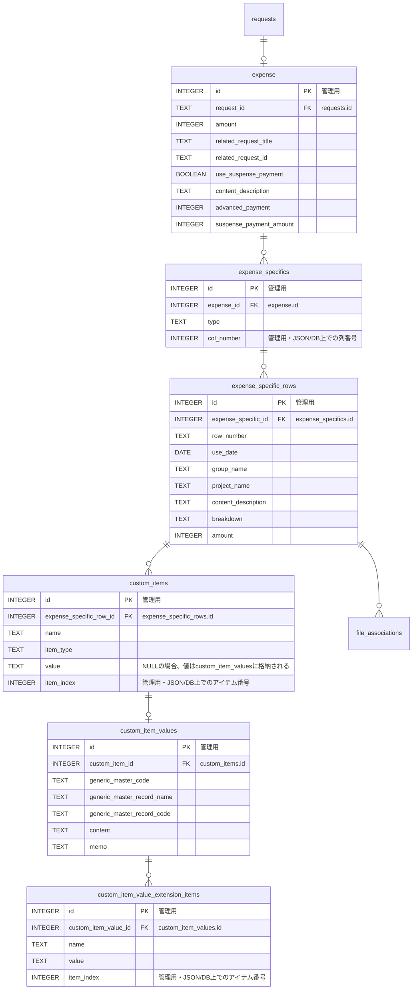

**図** expenseテーブルまわりのER図．`管理用`と書かれている部分は元データには存在しないキーです．また、複合UNIQUE制約については省略しています．

### payment

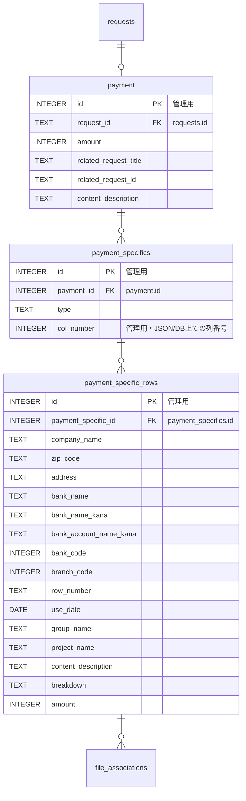

**図** paymentテーブルまわりのER図．`管理用`と書かれている部分は元データには存在しないキーです．また、複合UNIQUE制約については省略しています．

### ec

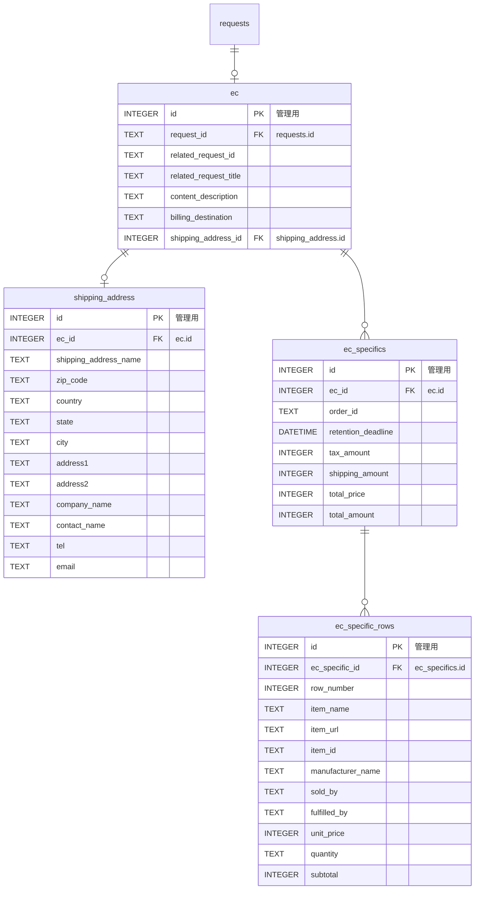

**図** ecテーブルまわりのER図．`管理用`と書かれている部分は元データには存在しないキーです．また、複合UNIQUE制約については省略しています．

### approval_process

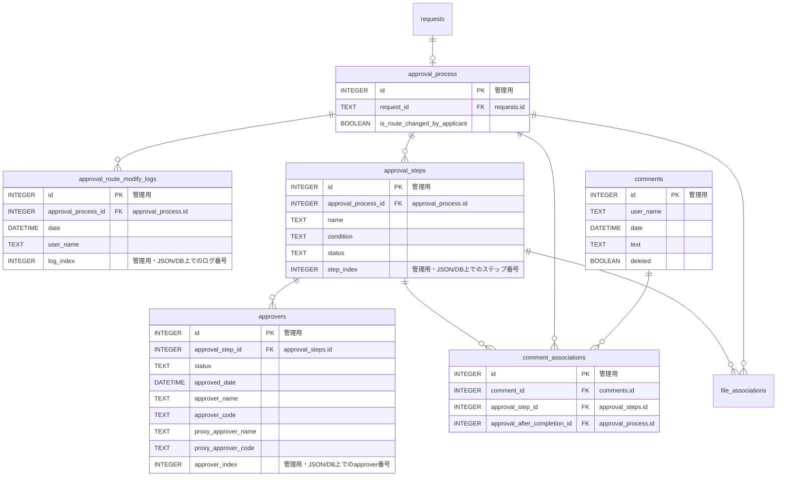

**図** approval_processテーブルまわりのER図．`管理用`と書かれている部分は元データには存在しないキーです．また、複合UNIQUE制約については省略しています．

### viewers

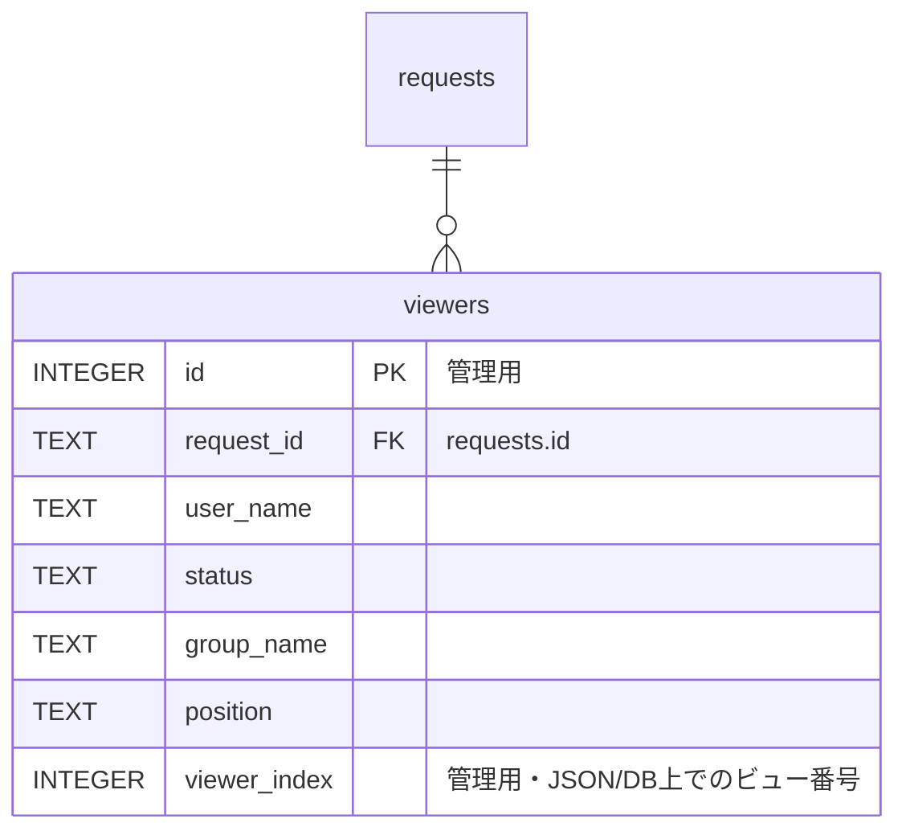

**図** viewersテーブルまわりのER図．`管理用`と書かれている部分は元データには存在しないキーです．また、複合UNIQUE制約については省略しています．

### 変更履歴 (modify_logs)

　申請書の変更履歴を格納するテーブルです。変更履歴には、その変更が行われた日時やユーザー名、変更内容が含まれます。

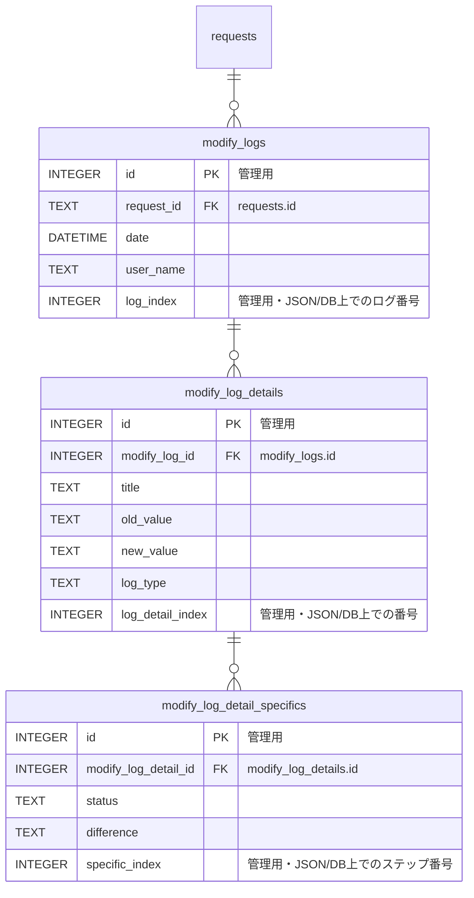

**図** modify_logsテーブルまわりのER図．`管理用`と書かれている部分は元データには存在しないキーです．また、複合UNIQUE制約については省略しています．

### ファイル (files)

　申請書に添付されたファイル情報を格納するテーブルです。ファイル情報には、ファイルの基本情報およびどこに紐づいているかが含まれます。

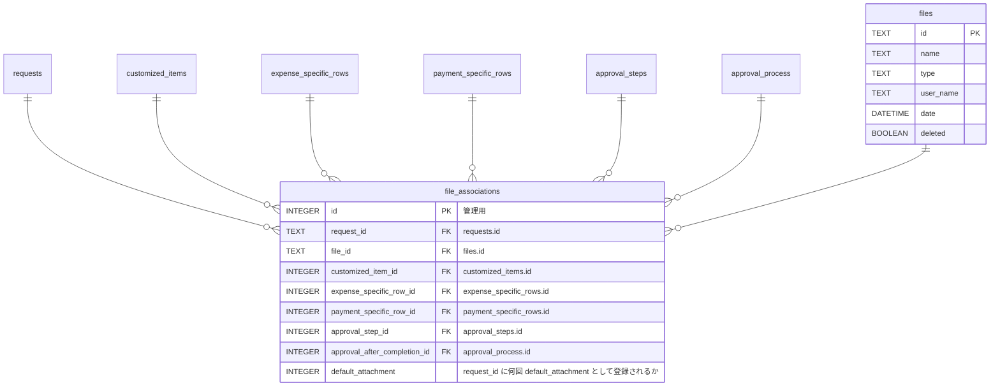

**図** filesテーブルまわりのER図．`管理用`と書かれている部分は元データには存在しないキーです．また、複合UNIQUE制約については省略しています．

### 申請書 (requests) まとめ

作成したテーブルのER図を以下に作成します。

```mermaid
erDiagram
    requests ||--o{ customized_items : ""
    requests ||--o| expense : ""
    requests ||--o| payment : ""
    requests ||--o| ec : ""
    requests ||--o| approval_process : ""
    requests ||--o{ viewers : ""
    requests ||--o{ modify_logs : ""
    requests ||--o{ file_associations : ""

    customized_items ||--o| generic_masters : ""
    customized_items ||--o{ file_associations : ""
    customized_items ||--o{ table_data : ""
    table_data ||--o{ generic_masters : ""
    generic_masters ||--o{ generic_master_additional_items : ""

    expense ||--o{ expense_specifics : ""
    expense_specifics ||--o{ expense_specific_rows : ""
    expense_specific_rows ||--o{ custom_items : ""
    expense_specific_rows ||--o{ file_associations : ""
    custom_items ||--o| custom_item_values : ""
    custom_item_values ||--o{ custom_item_value_extension_items : ""

    payment ||--o{ payment_specifics : ""
    payment_specifics ||--o{ payment_specific_rows : ""
    payment_specific_rows ||--o{ file_associations : ""

    ec ||--o| shipping_address : ""
    ec ||--o| ec_specifics : ""
    ec_specifics ||--o{ ec_specific_rows : ""

    approval_process ||--o{ approval_route_modify_logs : ""
    approval_process ||--o{ approval_steps : ""
    approval_steps ||--o{ approvers : ""
    approval_steps ||--o{ comment_associations : ""
    approval_steps ||--o{ file_associations : ""
    approval_process ||--o{ comment_associations : ""
    approval_process ||--o{ file_associations : ""

    modify_logs ||--o{ modify_log_details : ""
    modify_log_details ||--o{ modify_log_detail_specifics : ""

    files ||--o{ file_associations : ""
    comments ||--o{ comment_associations : ""

requests {
    TEXT id
    TEXT title
    TEXT status
    INTEGER form_id
    TEXT form_name
    TEXT form_type
    TEXT settlement_type
    DATETIME applied_date
    TEXT applicant_code
    TEXT applicant_last_name
    TEXT applicant_first_name
    TEXT applicant_group_name
    TEXT applicant_group_code
    TEXT applicant_position_name
    TEXT proxy_applicant_last_name
    TEXT proxy_applicant_first_name
    TEXT group_name
    TEXT group_code
    TEXT project_name
    TEXT project_code
    TEXT flow_step_name
    BOOLEAN is_content_changed
    INTEGER total_amount
    DATETIME pay_at
    DATETIME final_approval_period
    DATETIME final_approved_date
}

customized_items {
    INTEGER id
    TEXT request_id
    TEXT title
    TEXT content
    INTEGER item_index "JSON/DB上でのアイテム番号"
}

generic_masters {
    INTEGER id
    TEXT record_name
    TEXT record_code
    INTEGER customized_item_id
    INTEGER table_data_id
}

generic_master_additional_items {
    INTEGER id
    INTEGER generic_master_id
    TEXT item_value
    INTEGER item_index "JSON/DB上でのアイテム番号"
}

table_data {
    INTEGER id
    INTEGER customized_item_id
    INTEGER column_number
    TEXT value
    INTEGER index_1 "JSON/DB上での列番号 (二重リストの外側)"
    INTEGER index_2 "JSON/DB上での行番号 (二重リストの内側)"
}

expense {
    INTEGER id
    TEXT request_id
    INTEGER amount
    TEXT related_request_title
    TEXT related_request_id
    BOOLEAN use_suspense_payment
    TEXT content_description
    INTEGER advanced_payment
    INTEGER suspense_payment_amount
}

expense_specifics {
    INTEGER id
    INTEGER expense_id
    TEXT type
    INTEGER col_number "JSON/DB上での列番号"
}

expense_specific_rows {
    INTEGER id
    INTEGER expense_specific_id
    TEXT row_number
    DATE use_date
    TEXT group_name
    TEXT project_name
    TEXT content_description
    TEXT breakdown
    INTEGER amount
}

custom_items {
    INTEGER id
    INTEGER expense_specific_row_id
    TEXT name
    TEXT item_type
    TEXT value "NULLの場合、値はcustom_item_valuesに格納される"
    INTEGER item_index "JSON/DB上でのアイテム番号"
}

custom_item_values {
    INTEGER id
    INTEGER custom_item_id
    TEXT generic_master_code
    TEXT generic_master_record_name
    TEXT generic_master_record_code
    TEXT content
    TEXT memo
}

custom_item_value_extension_items {
    INTEGER id
    INTEGER custom_item_value_id
    TEXT name
    TEXT value
    INTEGER item_index "JSON/DB上でのアイテム番号"
}

payment {
    INTEGER id
    TEXT request_id
    INTEGER amount
    TEXT related_request_title
    TEXT related_request_id
    TEXT content_description
}

payment_specifics {
    INTEGER id
    INTEGER payment_id
    TEXT type
    INTEGER col_number "JSON/DB上での列番号"
}

payment_specific_rows {
    INTEGER id
    INTEGER payment_specific_id
    TEXT company_name
    TEXT zip_code
    TEXT address
    TEXT bank_name
    TEXT bank_name_kana
    TEXT bank_account_name_kana
    INTEGER bank_code
    INTEGER branch_code
    TEXT row_number
    DATE use_date
    TEXT group_name
    TEXT project_name
    TEXT content_description
    TEXT breakdown
    INTEGER amount
}

ec {
    INTEGER id
    TEXT request_id
    TEXT related_request_id
    TEXT related_request_title
    TEXT content_description
    TEXT billing_destination
    INTEGER shipping_address_id
}

shipping_address {
    INTEGER id
    INTEGER ec_id
    TEXT shipping_address_name
    TEXT zip_code
    TEXT country
    TEXT state
    TEXT city
    TEXT address1
    TEXT address2
    TEXT company_name
    TEXT contact_name
    TEXT tel
    TEXT email
}

ec_specifics {
    INTEGER id
    INTEGER ec_id
    TEXT order_id
    DATETIME retention_deadline
    INTEGER tax_amount
    INTEGER shipping_amount
    INTEGER total_price
    INTEGER total_amount
}

ec_specific_rows {
    INTEGER id
    INTEGER ec_specific_id
    INTEGER row_number
    TEXT item_name
    TEXT item_url
    TEXT item_id
    TEXT manufacturer_name
    TEXT sold_by
    TEXT fulfilled_by
    INTEGER unit_price
    TEXT quantity
    INTEGER subtotal
}

approval_process {
    INTEGER id
    TEXT request_id
    BOOLEAN is_route_changed_by_applicant
}

approval_route_modify_logs {
    INTEGER id
    INTEGER approval_process_id
    DATETIME date
    TEXT user_name
    INTEGER log_index "JSON/DB上でのログ番号"
}

approval_steps {
    INTEGER id
    INTEGER approval_process_id
    TEXT name
    TEXT condition
    TEXT status
    INTEGER step_index "JSON/DB上でのステップ番号"
}

approvers {
    INTEGER id
    INTEGER approval_step_id
    TEXT status
    DATETIME approved_date
    TEXT approver_name
    TEXT approver_code
    TEXT proxy_approver_name
    TEXT proxy_approver_code
    INTEGER approval_index "JSON/DB上でのapprover番号"
}

comments {
    INTEGER id
    TEXT user_name
    DATETIME date
    TEXT text
    BOOLEAN deleted
}

comment_associations {
    INTEGER id
    INTEGER comment_id
    INTEGER approval_step_id
    INTEGER approval_after_completion_id "approval_process.id"
}

viewers {
    INTEGER id
    TEXT request_id
    TEXT user_name
    TEXT status
    TEXT group_name
    TEXT position
    INTEGER view_index "JSON/DB上でのビュー番号"
}

modify_logs {
    INTEGER id
    TEXT request_id
    DATETIME date
    TEXT user_name
    INTEGER log_index "JSON/DB上でのログ番号"
}

modify_log_details {
    INTEGER id
    INTEGER modify_log_id
    TEXT title
    TEXT old_value
    TEXT new_value
    TEXT log_type
    INTEGER log_detail_index "JSON/DB上での番号"
}

modify_log_detail_specifics {
    INTEGER id
    INTEGER modify_log_detail_id
    TEXT status
    TEXT difference
    INTEGER specific_index "JSON/DB上でのステップ番号"
}

files {
    TEXT id
    TEXT name
    TEXT type
    TEXT user_name
    DATETIME date
    BOOLEAN deleted
}

file_associations {
    INTEGER id
    TEXT request_id
    TEXT file_id
    INTEGER customized_item_id
    INTEGER expense_specific_row_id
    INTEGER payment_specific_row_id
    INTEGER approval_step_id
    INTEGER approval_after_completion_id "approval_process.id"
    INTEGER default_attachment "request_id に何回 default_attachment として登録されるか"
}
```

---

> [全体の目次に戻る](../README.html)
