# Tips

## 目次

- [目次](#目次)
- [実行に際して](#実行に際して)
  - [アプリケーションのビルド](#アプリケーションのビルド)
    - [オプションの説明](#オプションの説明)
- [データベースなどとの接続](#データベースなどとの接続)
  - [Power BI (Service) を介した接続](#power-bi-service-を介した接続)
    - [On-premises Data Gateway のインストール](#on-premises-data-gateway-のインストール)
    - [SQLite ODBC Driver のインストール](#sqlite-odbc-driver-のインストール)
    - [ODBC Data Source の設定](#odbc-data-source-の設定)
    - [Power BI の設定](#power-bi-の設定)
  - [Excel との接続](#excel-との接続)
    - [SQLite ODBC Driver のインストール (再)](#sqlite-odbc-driver-のインストール-再)
    - [ODBC Data Source の設定 (再)](#odbc-data-source-の設定-再)
    - [Excel での設定](#excel-での設定)

## 実行に際して

### アプリケーションのビルド

　本アプリケーションは`nuitka`を用いてビルドしています。nuitkaが未インストールの場合は`pip install nuitka`を実行した後、本体 (`main.py`) のビルドに以下のコマンドを実行してください。

```bash
nuitka --windows-console-mode=disable --standalone --follow-imports main.py
```

　また、`コンフィグ設定用のGUIをビルドする際は以下のコマンドを実行してください。

```bash
nuitka --windows-console-mode=disable --standalone --follow-imports --enable-plugin=tk-inter config_gui.py
```

#### オプションの説明

| オプション | 説明 |
| --- | --- |
| `--windows-console-mode=disable` | Windows環境でコンソールを非表示にします。 |
| `--standalone` | 依存ライブラリを同梱します（Python環境のない場所でも動かせるようにします）。 |
| `--follow-imports` | 利用しているモジュールを自動的に検出します。 |
| `--enable-plugin=tk-inter` | Tkinterを使用する場合に指定します。 |

## データベースなどとの接続

### Power BI (Service) を介した接続

Power BI Service（EdgeやChromeなどのブラウザからアクセスするPower BI）と、ローカルのSQLデータベースを接続する方法についての説明です。

デスクトップ上で動かすPower BI Desktopとは手順が少し異なります。Power BI Desktopの場合については、[Excel との接続](#excel-との接続)および[このサイト](https://zenn.dev/yumizz/articles/7766b035673b2f)などを参考にしてください。

#### On-premises Data Gateway のインストール

Power BI Serviceからローカルのデータベースにアクセスするためには、オンプレミスデータゲートウェイをインストールする必要があります。以下のサイトにアクセスし、ダウンロードを行います。

https://go.microsoft.com/fwlink/?LinkId=2116849&clcid=0x409

途中でサインインを求められる場合があります。その際は、Power Bi Serviceのログインに使用しているアカウント（組織アカウント）でサインインしてください。次の画面で「このコンピューターに新しいゲートウェイを登録します」を選択します。

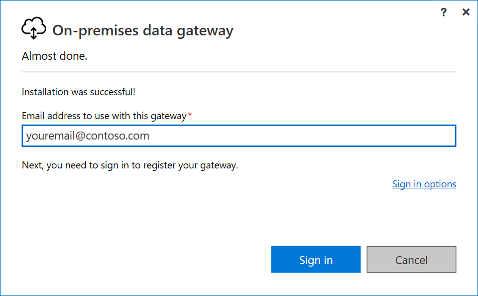

図. サインイン画面[*](https://learn.microsoft.com/ja-jp/data-integration/gateway/service-gateway-install)

ゲートウェイの名前と回復キーの設定を行います。ゲートウェイの名前は全体で一意である必要があります。ここで設定したキーが[Power BIの設定](#power-bi-の設定)で使用されます。

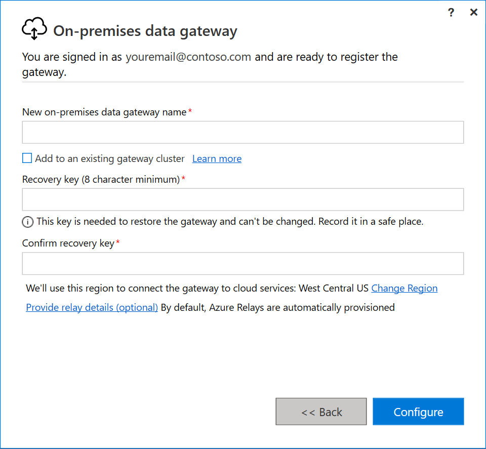

図. ゲートウェイの設定画面[*](https://learn.microsoft.com/ja-jp/data-integration/gateway/service-gateway-install)

以下のような画面が表示されればインストールは完了です。


#### SQLite ODBC Driver のインストール

以下のサイトにアクセスし、ドライバーをインストールします。インストール可能なバージョンには32bit（`sqliteodbc.exe`）と64bit（`sqliteodbc_w64.exe`）の2種類があり、オンプレミスデータゲートウェイと合わせる必要があります。本稿では、64bitのオンプレミスデータゲートウェイをインストールしたとしてセットアップを進めます。

http://www.ch-werner.de/sqliteodbc/

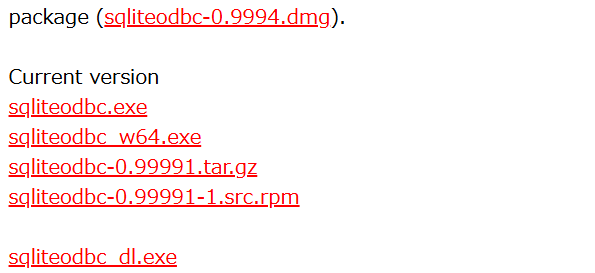

図. サイト上のドライバーの種類

> bit 数を合わせない場合、Power BI での接続の際に以下のようなエラーが発生することがあります。
>
> 

ダウンロードしたファイルを実行し、インストールを開始します。起動時に管理者権限が要求されます。

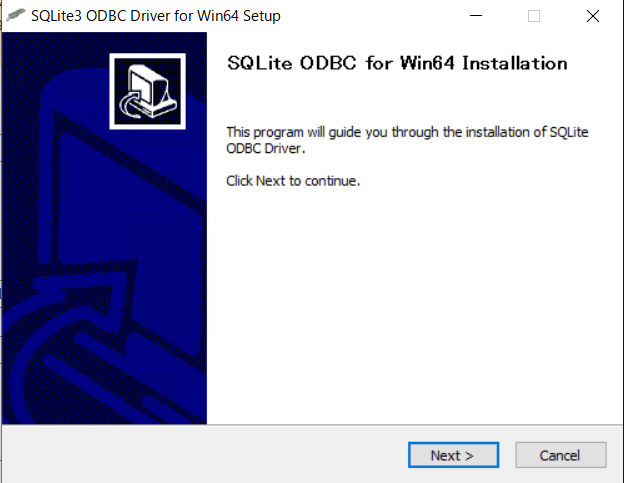

図. インストール画面

いくつかの画面を進めると、以下の画面が表示されます。`Sqlite 2 Drivers`にチェックを入れ、`Install`をクリックしてください。これでSQLite ODBC Driverのインストールは完了です。

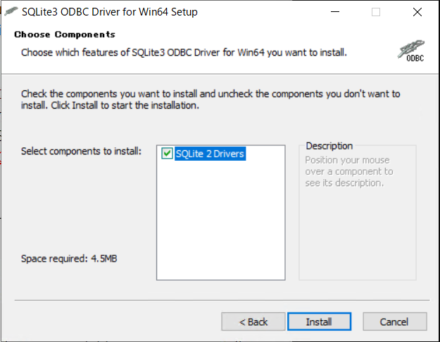

#### ODBC Data Source の設定

Windowsの検索欄から`ODBC データ ソース (64 ビット)`を検索し、これを実行します。

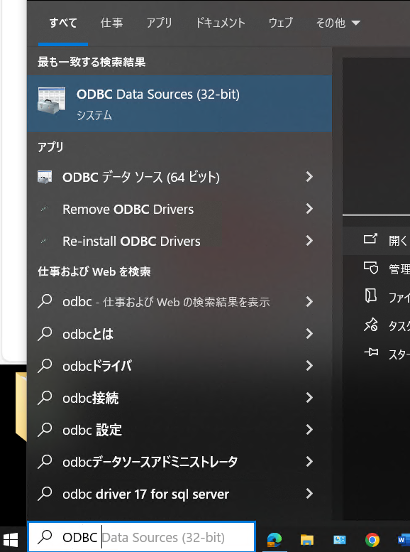

> [ODBC Driver](#sqlite-odbc-driver-のインストール)と同様に、オンプレミスデータゲートウェイと同じbit数のものを起動します。

以下のような画面が開くので、「**システム DSN**」タブから「追加」ボタンをクリックし、先ほどインストールしたドライバーを選択します。

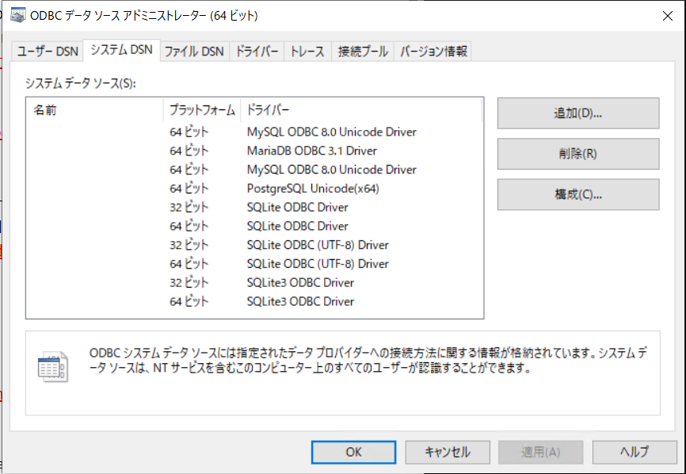

本アプリケーションはSQLite3を扱うため、「SQLite3 ODBC Driver」を選択します。

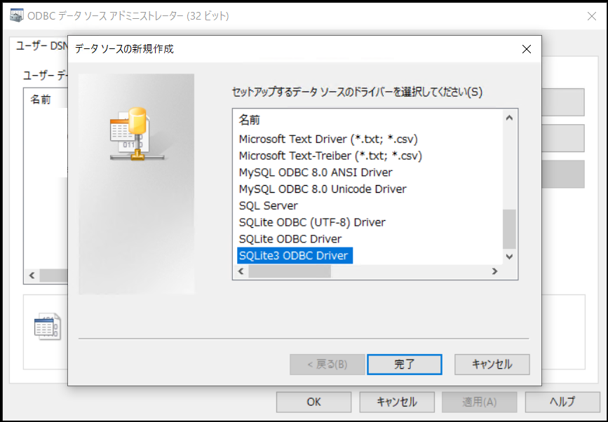

次に以下のような画面が表示されるため、`Data Source Name`には適当な名前（以下では`JobcanDI`としています）を、`Database Name`には本アプリケーションの作成する`jobcan-data.db`のパスを入力します。後者に関しては、右の`Browse...`から当該ファイルを選択するのが簡単です。

以上を入力後、「OK」を選択します。

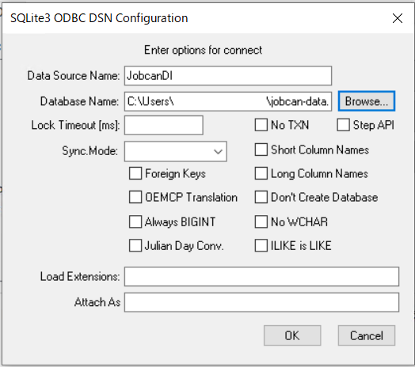

システムDSNに`JobcanDI`が追加されました。

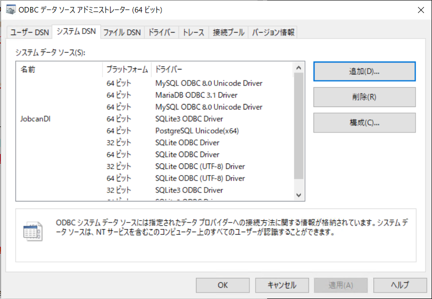

#### Power BI の設定

PowerBIから、適当なワークスペースを選択、または作成します。今回は、`ジョブカン`ワークスペースを作成しました。

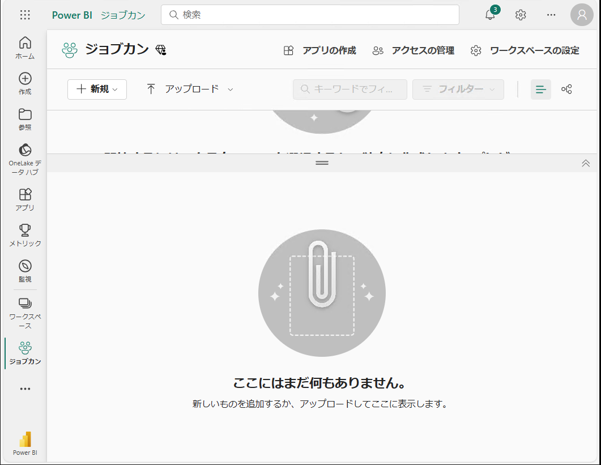

左上の「新規」ボタンから「データフロー」を選択します。

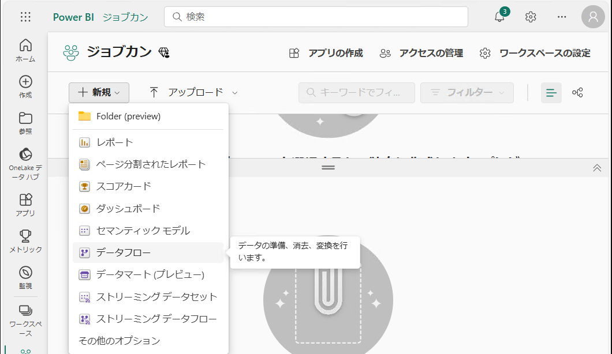

以下のような画面に遷移するので、次に「新しいテーブルの追加」を選択します。

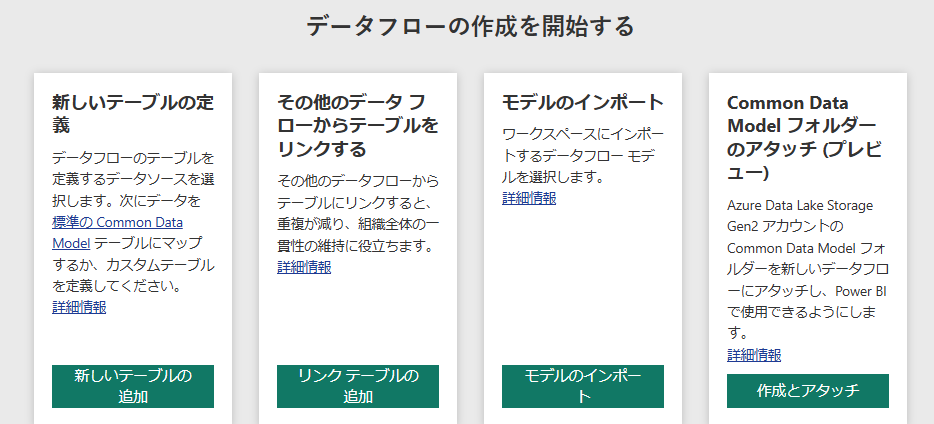

データソースとして「ODBC」を選択します。

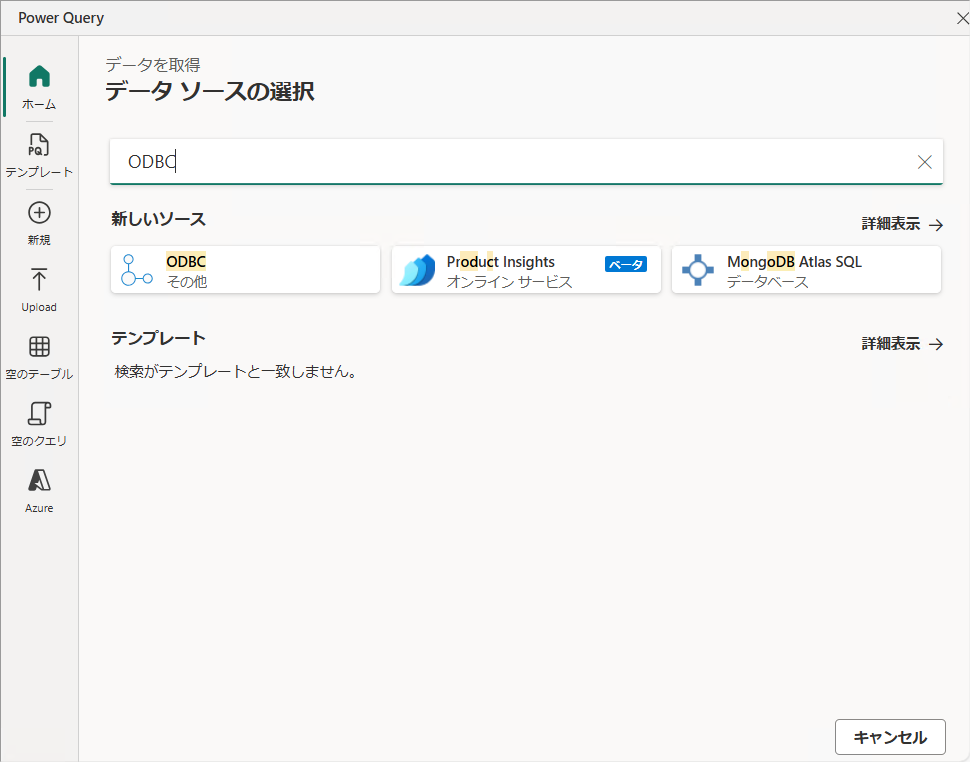

ODBC接続文字列に、DSNとして[ODBCの設定](#odbc-data-source-の設定)で指定した名前（今回は`dsn=JobcanDI`）を指定します。

「新しい接続の作成」を選択し、データゲートウェイとしてパソコン上に作成したオンプレミスデータゲートウェイの名前を選択します。

また、認証の種類として`Windows`を選択し、本アプリケーションをダウンロードした「ユーザ名」と、そのユーザーの「パスワード」（ログイン時に使用するもの）を入力します。

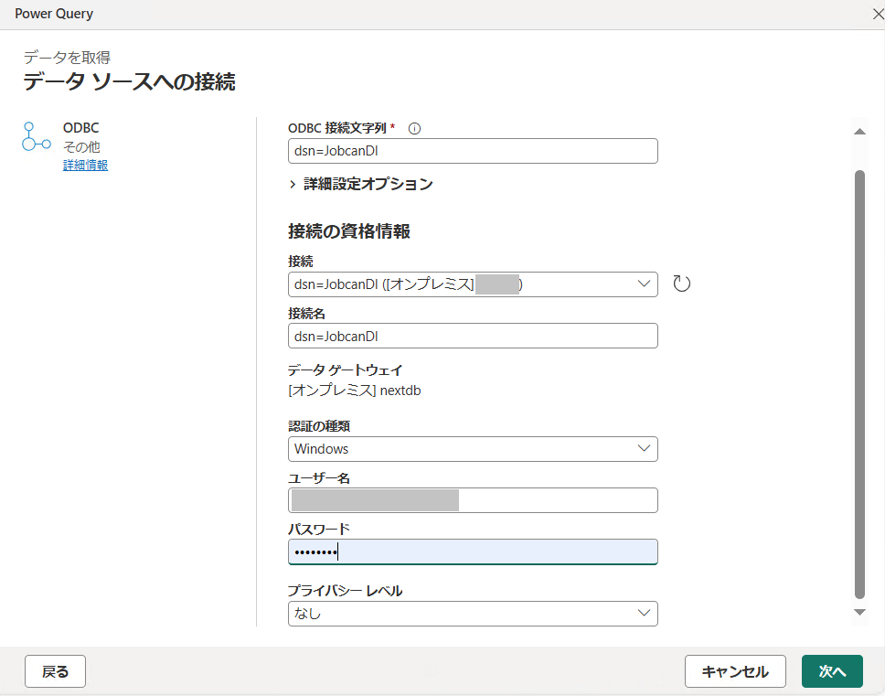

以下のようにデータが読み込まれれば成功です。

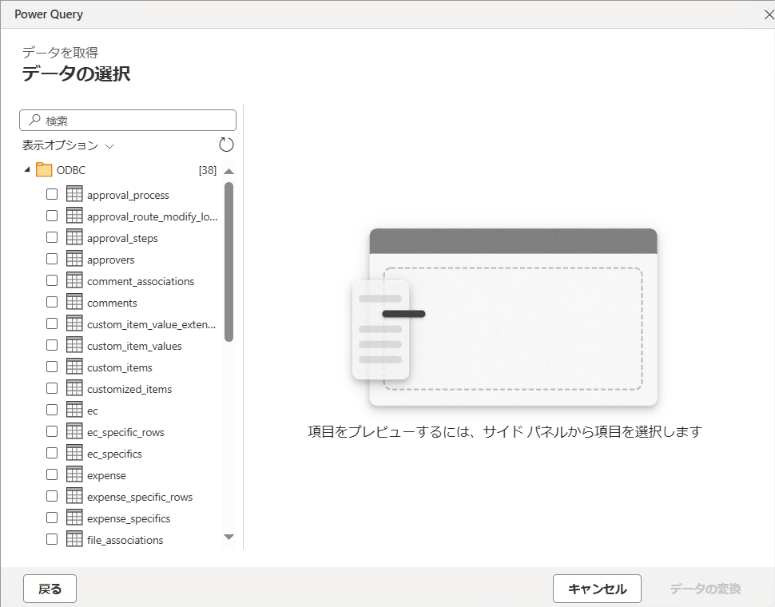

> 認証の種類を匿名のままにした場合には、以下のようなエラーが発生することがあります（前に外部サーバとSSHトンネルを通して接続した環境で同様の設定を行った際には匿名で接続できたはずなのですが…）。
>
> `例外が発生しました: ODBC: ERROR [HY000] connect failed ERROR [IM006] [Microsoft][ODBC Driver Manager] ドライバーの SQLSetConnectAttr は失敗しました。`

### Excel との接続

本アプリケーションの作成したデータベースをExcelから読み込む方法を説明します。

また、デスクトップ上で動かすPower BI Desktopについてもおおよそ同じステップで同期が可能です。

#### SQLite ODBC Driver のインストール (再)

上記[SQLite ODBC Driverのインストール](#sqlite-odbc-driver-のインストール)で説明したように、ODBCドライバーをインストールします。

bit数については64bitのものを選択すればよいかと思います。

#### ODBC Data Source の設定 (再)

上記[ODBC Data Sourceの設定](#odbc-data-source-の設定)と同じようにして、DSNを設定します。注意点ですが、システムDSNではなく**ユーザーDSNを設定してください**。以下では、上記同様に`JobcanDI`として設定したとします。

#### Excel での設定

適当なシートを開き、「データ」タブから「データの取得」→「その他のデータソースから」→「ODBCから」を選択します。

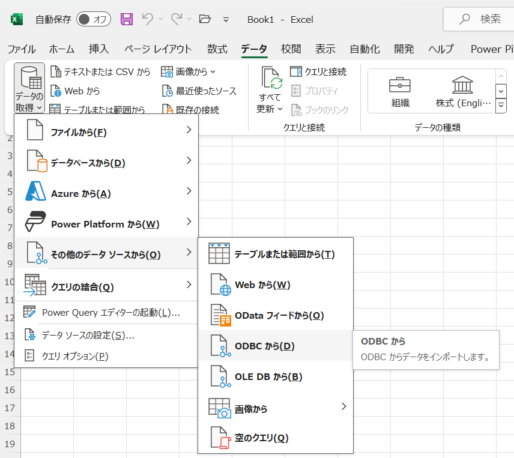

データソースとして先ほど設定したユーザーDSN（`JobcanDI`）を選択します。ユーザー名とパスワードを聞かれた場合は、現在ログインしているユーザー名を入力してください。おそらくパスワードは入力しなくて大丈夫かと思います。

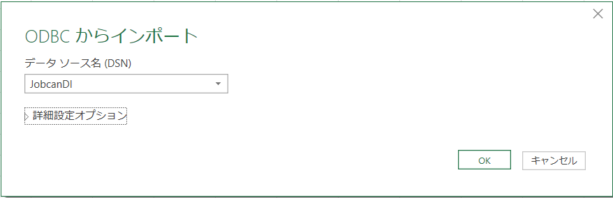

以下のような画面が開かれれば成功です。

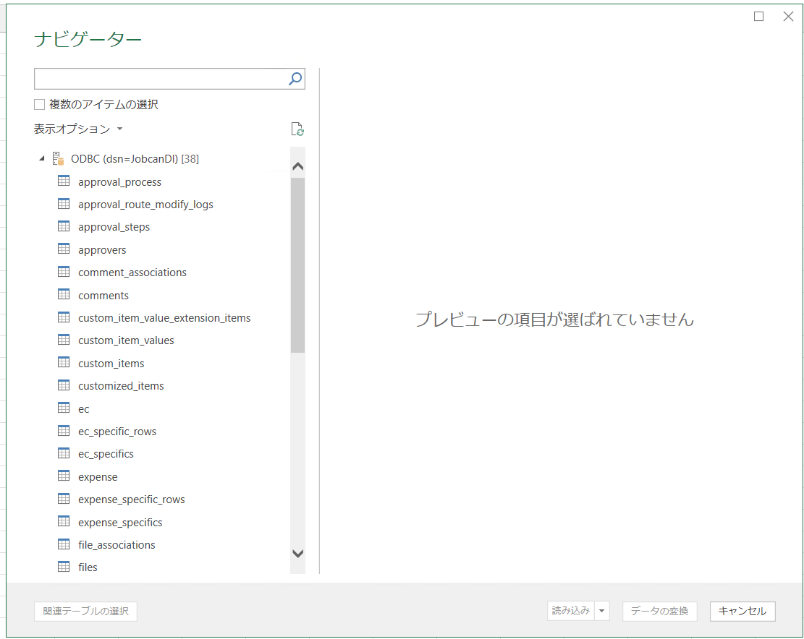
