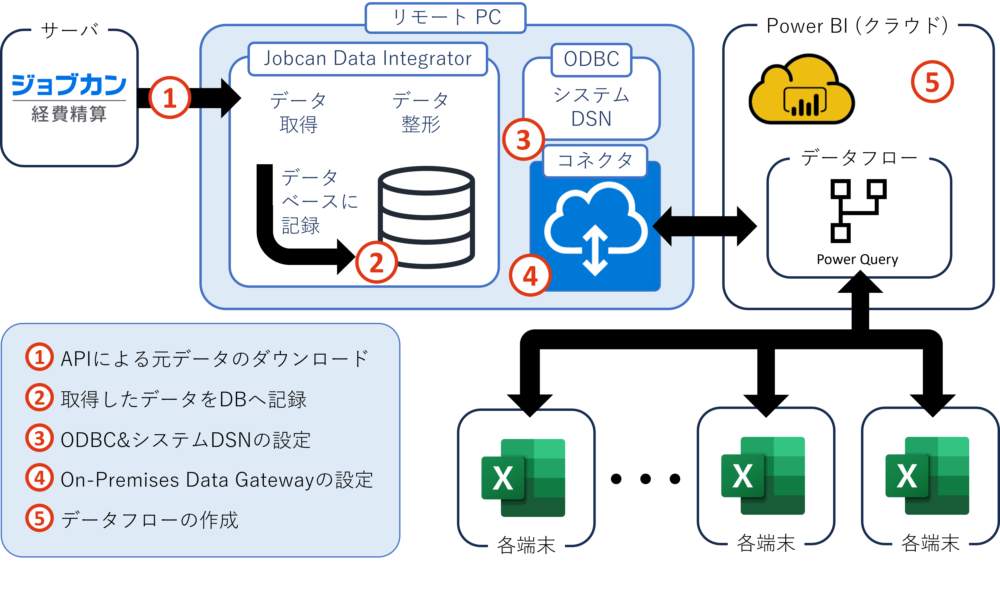

# ソフトウェア

## 目次

- [目次](#目次)
- [概要](#概要)
  - [基本機能](#基本機能)
    - [1. APIから取得したデータの整形](#1-apiから取得したデータの整形)
- [機能説明](#機能説明)
  - [1.](#1)
- [注意点](#注意点)

## 概要

　**Jobcan Data Integrator**は、ジョブカン経費精算の扱う申請書データ等の取得、Power BI等への同期を自動化するためのソフトウェアです。

　申請書をPower BI等へ同期させる場合、従来はすべての申請書をCSVとして毎日ダウンロードし、これをPower BIに取り込む必要がありました。しかし、本ソフトウェアを利用することで、申請書データを自動的に取得し、データベースに保存することができます。

**図** システム全体像

　図に示したシステム全体像の流れは以下の通りです。このうち1～2の部分が本ソフトウェアの機能になります。3～5の部分は、本ソフトウェア導入後に、本ソフトウェアを導入したパソコンで設定する必要があります。

1. ジョブカン経費精算/ワークフローAPIを利用して申請書データを取得
2. 取得したデータをデータベースに保存できる形式に変換し、データベースに保存
3. ODBC connectorを利用し、Power BI等がデータベースにアクセスできるようにシステムDSNを設定
4. On-Premises Data Gatewayを利用し、Power BI Serviceからデータベースにアクセスできるように設定
5. Power BI Serviceを利用してデータフローを作成し、異なるパソコンからデータベースにアクセス

### 基本機能

#### 1. APIから取得したデータの整形

　ジョブカンのAPIから取得したデータは、

## 機能説明

### 1. 

## 注意点

　本ソフトウェアはジョブカン経費精算/ワークフローの提供するAPIを利用しています。このため、このAPIが提供していない機能・情報にアクセスすることはできません。

**表** APIから取得できない情報

| 概要 | 説明 |
| --- | --- |
| `取り消し`状態の申請書の詳細情報 | 取り消し状態にある申請書については、基本情報を除きAPIからデータを取得できません。ここで、基本情報とは申請書種別、タイトル、申請者情報、申請日時、支払予定日、最終承認日等の情報を指します。 |